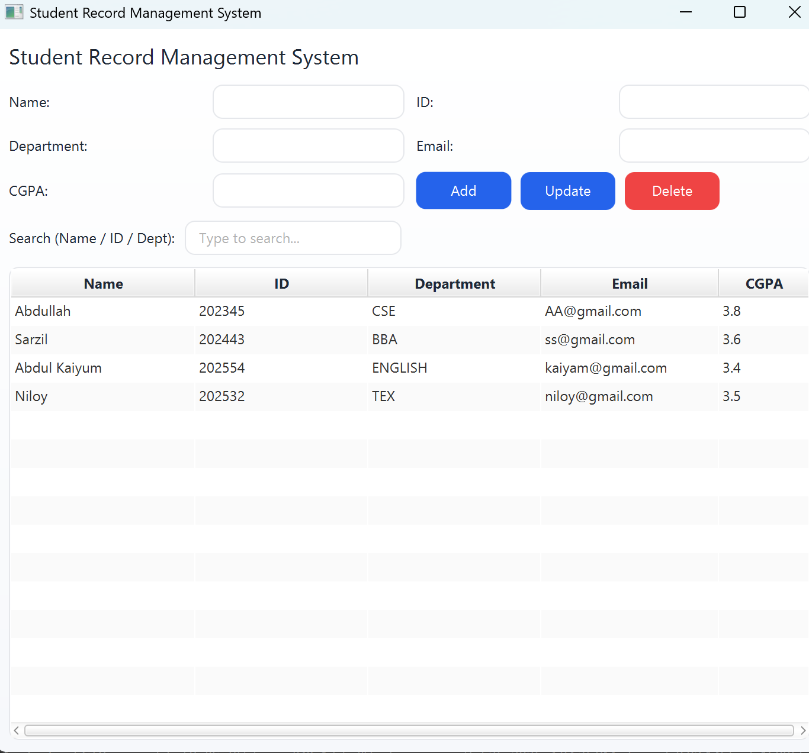
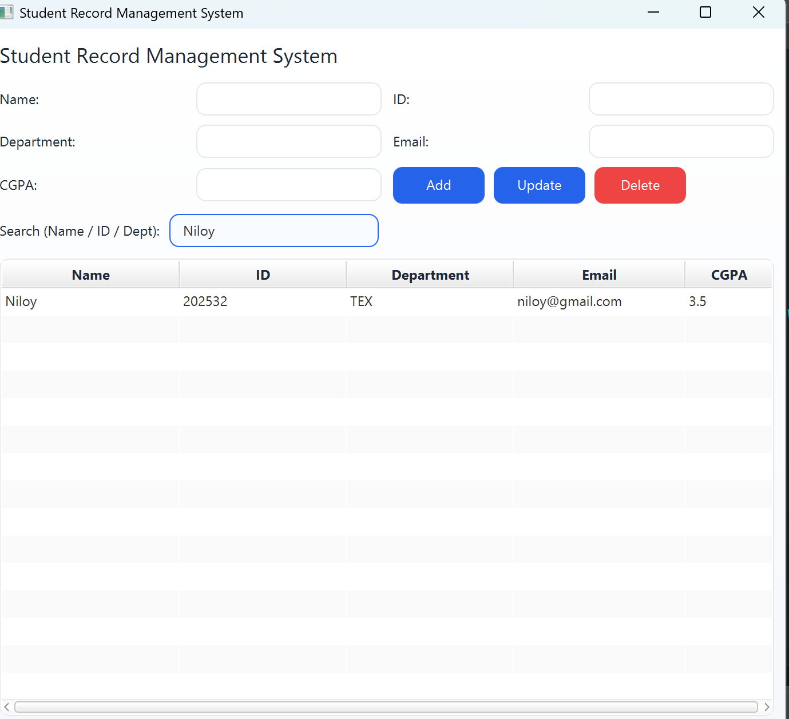

<p align="center">
  
  
  
  
  
</p>

# 📚 Student Record Management System

A clean, modern desktop application built with **JavaFX** to manage student records. It supports full **CRUD operations** (Create, Read, Update, Delete), **real-time live search**, and **persistent CSV-based storage** — all wrapped in a polished, responsive UI designed with **Scene Builder**.

---

## ✨ Features

| Feature | Description |
|---|---|
| ➕ **Add Student** | Add a new student with Name, ID, Department, Email, and CGPA |
| ✏️ **Update Student** | Select a record from the table and update any field |
| 🗑️ **Delete Student** | Remove a selected student with a confirmation dialog |
| 🔍 **Live Search** | Instantly filter records by Name, ID, or Department as you type |
| 💾 **Persistent Storage** | All data is saved to a CSV file and loaded automatically on startup |
| ✅ **Input Validation** | Validates email format, CGPA range (0.00–4.00), required fields, and unique IDs |
| 📋 **Click-to-Edit** | Click any row in the table to populate the form fields for quick editing |
| 🔄 **Auto-Save on Exit** | Data is automatically saved when the application window is closed |

---

## 📸 Screenshots

### Application Overview
> Main window showing the form, action buttons, search bar, and student table.



### Search by Name
> Live search filtering students by name — results update instantly as you type.




---

## 🛠️ Tech Stack

| Technology | Purpose |
|---|---|
| **Java 17** | Core programming language |
| **Liberica JDK 17 (Full)** | JDK distribution with bundled JavaFX support |
| **JavaFX SDK** | GUI framework for building the desktop interface |
| **FXML** | Declarative UI layout (designed with Scene Builder) |
| **CSS** | Custom styling for a modern, polished look |
| **Scene Builder** | Visual drag-and-drop tool for designing the FXML layout |
| **Eclipse IDE** | Development environment |
| **CSV** | Lightweight file-based data persistence |

---

## 📁 Project Structure

```
StudentRecordSystemJavaFX/
│
├── src/
│   ├── application/
│   │   └── Main.java              # Application entry point (extends Application)
│   │
│   ├── controller/
│   │   └── MainController.java    # Handles all UI logic, CRUD, search & validation
│   │
│   ├── model/
│   │   ├── Student.java           # Student model with JavaFX properties
│   │   └── StudentStore.java      # CSV-based data persistence (load/save)
│   │
│   └── view/
│       ├── Main_view.fxml         # UI layout designed with Scene Builder
│       └── app.css                # Custom stylesheet for the application
│
├── data/
│   └── students.csv               # Persistent data storage (auto-generated)
│
├── images/
│   ├── AppRunning-ss-01.png       # Screenshot — App running
│   └── SearchByname-ss-02.png     # Screenshot — Search by name
│
├── build.fxbuild                   # Eclipse JavaFX build configuration
└── README.md                       # This file
```

---

## 🏗️ Architecture

The project follows the **MVC (Model–View–Controller)** design pattern:

```
┌─────────────────────────────────────────────────────────────┐
│                        VIEW (FXML + CSS)                    │
│  Main_view.fxml  ──  Defines UI layout (Scene Builder)     │
│  app.css         ──  Styles buttons, table, inputs, cards   │
└──────────────────────────┬──────────────────────────────────┘
                           │  User interactions
                           ▼
┌─────────────────────────────────────────────────────────────┐
│                     CONTROLLER                              │
│  MainController.java                                        │
│  ├── initialize()    →  Binds data, sets up search filter   │
│  ├── addStudent()    →  Validates & adds new record         │
│  ├── updateStudent() →  Modifies selected record            │
│  ├── deleteStudent() →  Removes with confirmation           │
│  └── applyFilter()   →  Real-time search by name/id/dept   │
└──────────────────────────┬──────────────────────────────────┘
                           │  Data operations
                           ▼
┌─────────────────────────────────────────────────────────────┐
│                        MODEL                                │
│  Student.java       ──  JavaFX Property-based POJO          │
│  StudentStore.java  ──  CSV file I/O (load & save)          │
│                         └── data/students.csv               │
└─────────────────────────────────────────────────────────────┘
```

---

## 📋 Prerequisites

Before running this project, make sure you have the following installed:

- [**Liberica JDK 17 (Full)**](https://bell-sw.com/pages/downloads/#jdk-17-lts) — includes JavaFX modules out-of-the-box
- [**Eclipse IDE**](https://www.eclipse.org/downloads/) — with **e(fx)clipse** plugin for JavaFX support
- [**Scene Builder**](https://gluonhq.com/products/scene-builder/) — *(optional, for editing the FXML layout visually)*
- **JavaFX SDK** — configured in Eclipse as a User Library *(if not using Liberica Full)*

---

## 🚀 Getting Started

### 1. Clone the Repository

```bash
git clone https://github.com/abdullahalsahaf/StudentRecordSystem-JavaFX.git
cd StudentRecordSystem-JavaFX
```

### 2. Open in Eclipse

1. Open **Eclipse IDE**
2. Go to **File → Import → General → Existing Projects into Workspace**
3. Browse to the cloned project folder and click **Finish**

### 3. Configure JDK & JavaFX

1. **Right-click the project** → **Properties** → **Java Build Path**
2. Under **Libraries**, ensure the **JRE System Library** is set to **Liberica JDK 17 (Full)**
3. If using standard JDK, add the **JavaFX SDK** as a User Library:
   - Go to **Window → Preferences → Java → Build Path → User Libraries**
   - Click **New**, name it `JavaFX`
   - Add the JAR files from your JavaFX SDK's `lib/` folder

### 4. Run the Application

1. Open `src/application/Main.java`
2. **Right-click → Run As → Java Application**
3. The application window will launch

> **Note:** If you encounter module-related errors, add the following **VM Arguments** in the Run Configuration:
> ```
> --module-path "path/to/javafx-sdk/lib" --add-modules javafx.controls,javafx.fxml
> ```

---

## 💡 How to Use

1. **Add a Student** — Fill in all fields (Name, ID, Department, Email, CGPA) and click the **Add** button
2. **Update a Student** — Click on a row in the table to select it, modify the form fields, then click **Update**
3. **Delete a Student** — Select a row and click **Delete**, then confirm in the dialog
4. **Search** — Type in the search bar to instantly filter records by Name, ID, or Department
5. **Data Persistence** — All changes are auto-saved to `data/students.csv`

---

## 🔒 Validation Rules

| Field | Rule |
|---|---|
| **All Fields** | Required — cannot be empty |
| **Email** | Must match a valid email format (e.g., `user@example.com`) |
| **CGPA** | Must be a number between `0.00` and `4.00` |
| **Student ID** | Must be unique across all records |

---

## 🎓 Course Information

| | |
|---|---|
| **Course** | CSE 110 — Object Oriented Programming (OOP) |
| **Semester** | Summer 2025 |
| **University** | [East West University (EWU)](https://www.ewubd.edu), Dhaka, Bangladesh |
| **Faculty** | [Dr. Anup Kumar Paul (DAKP)](https://fse.ewubd.edu/computer-science-engineering/faculty-view/anuppaul) — Associate Professor, Dept. of CSE |
| **Student** | Abdullah AL Sahaf |

---

## 📄 License

This project is open source and available under the [MIT License](LICENSE).

---

<p align="center">
  Made with ❤️ by <b>Abdullah AL Sahaf</b> using Java & JavaFX
</p>
